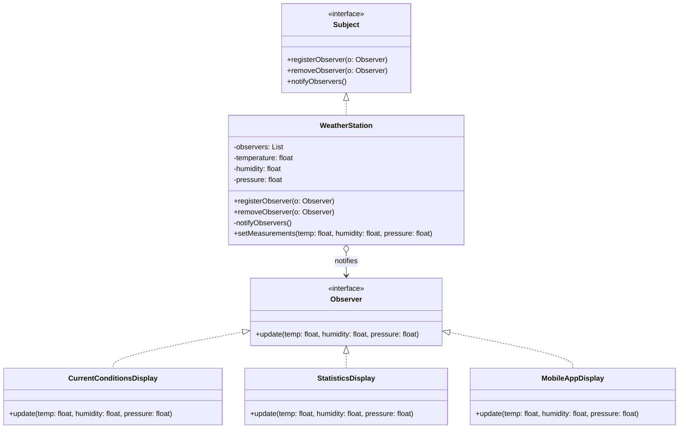
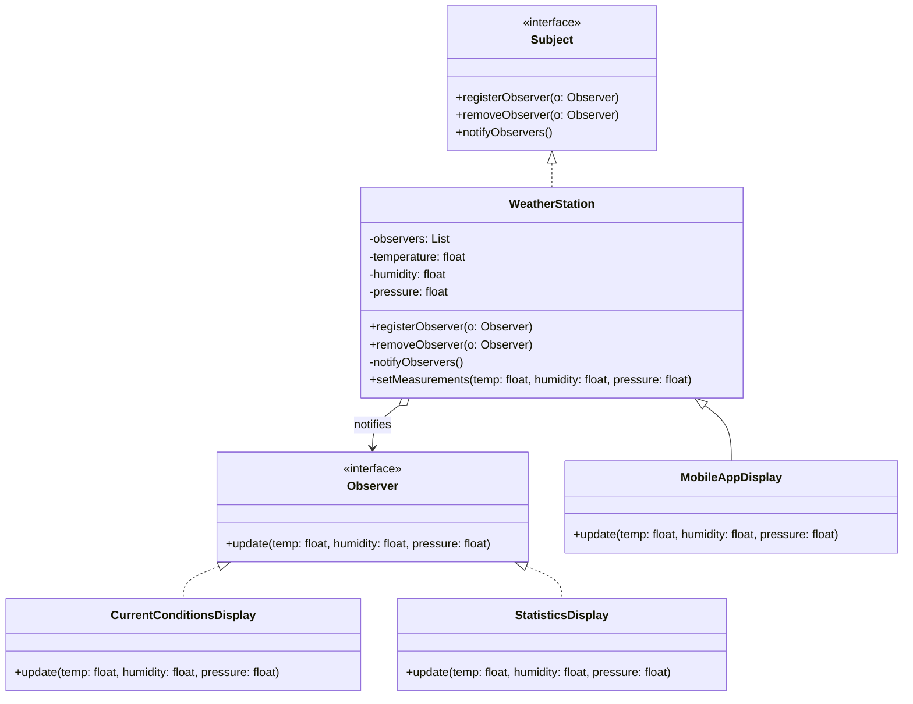

# Estação Meteorológica com Padrão Observer

## Resumo do Projeto

**Nome do Projeto:** Estação Meteorológica utilizando o Padrão Observer

## Visão Geral

Este projeto demonstra o **Padrão de Projeto Observer** de forma simples e prática, modelando um sistema de monitoramento climático. Uma central `WeatherStation` (o **Subject**) coleta e distribui dados meteorológicos para vários **Observers**, como unidades de exibição e aplicativos móveis. Cada observer se atualiza automaticamente quando há mudanças no clima.

## Objetivo

**Desacoplar a fonte de dados principal** (`WeatherStation`) dos seus componentes dependentes (`Displays`), permitindo que evoluam de forma independente e possam ser reutilizados ou substituídos sem impactar uns aos outros.

## Principais Componentes

| Componente                 | Responsabilidade                                                          |
| -------------------------- | ------------------------------------------------------------------------- |
| Interface `Subject`        | Permite que observers se registrem, cancelem registro e sejam notificados |
| Interface `Observer`       | Declara o método `update()` que os observers devem implementar            |
| Classe `WeatherStation`    | Armazena os dados climáticos e notifica todos os observers                |
| `CurrentConditionsDisplay` | Exibe a temperatura atual                                                 |
| `StatisticsDisplay`        | Acompanha temperatura mínima, máxima e média                              |
| `MobileAppDisplay`         | Simula um sistema de notificações via aplicativo móvel                    |

## Benefícios do Design

- Implementa o **Padrão Observer** para desacoplar estado de comportamento.
- Segue o **Princípio Aberto/Fechado**: permite adicionar novos displays sem modificar a lógica principal.
- Promove flexibilidade e **configuração dinâmica em tempo de execução** dos observers.

## Estrutura de Pastas

```plaintext
src/main/java/
└── edu/fatec/ipp002/observer/
    ├── observer/            # Interfaces Observer e Subject
    ├── model/               # WeatherStation (o subject)
    ├── display/             # Classes concretas de observers
    └── Main.java            # Ponto de entrada com exemplo de uso
```

## Casos de Uso

- Ensino e prática do Padrão Observer.
- Protótipos de sistemas de notificações modulares.
- Cenários onde múltiplos componentes dependem de mudanças em um estado compartilhado.

## Diagrama de Classes



## Exemplo de Anti-Padrão: Acoplamento Forte entre Observer e Subject

Se o subject faz suposições sobre implementações específicas dos observers, você perde o desacoplamento que o padrão deveria fornecer.

`Por que isso é ruim`: Quebra a flexibilidade do padrão e gera código frágil.

`Melhor Prática`: Comunique-se apenas por meio de interfaces, nunca por tipos concretos.



## Executando

Estando na pasta raiz onde se encontra o `pom.xml` — seja para o projeto _padrão_ ou _anti-padrão_ —, execute os seguintes comandos:

```bash
mvn clean install
mvn exec:java
```
