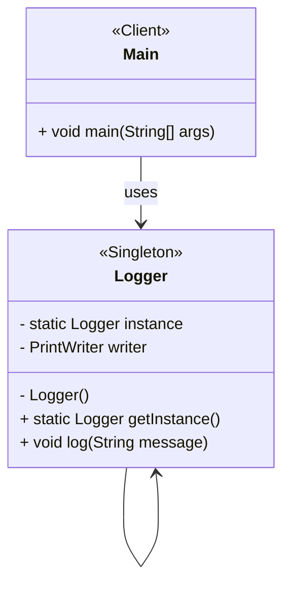

# Logger com Padrão Singleton

## Resumo do Projeto

**Nome do Projeto:** Logger utilizando o Padrão Singleton

## Visão Geral

Este projeto demonstra o uso do **Padrão de Projeto Singleton** implementando uma classe simples de Logger. O logger é responsável por escrever mensagens em um arquivo de log e garante que apenas uma instância seja criada e compartilhada por toda a aplicação.

## Objetivo

Demonstrar como o padrão Singleton ajuda a centralizar o acesso a um recurso compartilhado (neste caso, um arquivo de log). Ilustrando um uso real de Singleton: logging, que deve ser consistente e globalmente acessível.

## Principais Componentes

| Componente                | Responsabilidade                                                                                                |
| ------------------------- | --------------------------------------------------------------------------------------------------------------- |
| Classe Singleton `Logger` | Garante instância única, oferece acesso global via getInstance() e gerencia o log em arquivo.                   |
| Classe `Main`             | Demonstra o uso do Singleton.                                                                                   |
| Arquivo de Log `log.txt`  | Armazena as mensagens de log de forma consistente, independente de quantas partes da aplicação estejam logando. |

## Benefícios do Design

- Controle de acesso à única instância.
- Ponto global de acesso.
- Eficiência no uso de recursos.
- Inicialização preguiçosa (lazy).
- Consistência em toda a aplicação.
- Facilidade de manutenção e testes.

## Estrutura de Pastas

```plaintext
src/main/java/
└── edu/fatec/ipp002/singleton/
    ├── logger/         # Singleton
    ├── Main.java       # Uso
    └── log.txt         # Arquivo de log
```

## Casos de Uso

- **Gerenciador de Configuração:** Para ler configurações globais do app (de .properties, .env, XML/JSON) num único lugar.
- **Gerenciador de Pool de Conexões de Banco:** Gerenciar conexões DB centralizadamente melhora desempenho e evita excesso de conexões abertas.
- **Gerenciador de Cache:** Cache compartilhado na memória que todas as partes do app podem ler/gravar.
- **Gerenciador de Thread Pool:** Pools de threads devem ser reutilizados, não recriados a cada tarefa.
- **Gerenciador de Autenticação/Sessão:** Uma única classe que controla quem está logado ou gerencia tokens evita conflitos e garante segurança.
- **Drivers de Dispositivos ou Camada de Acesso a Hardware:** Normalmente se quer um controlador único para comunicação com hardware específico (ex: impressora, GPU).
- **Gerenciador de Configurações ou Estado de Jogo:** Em desenvolvimento de jogos, placares, dados de níveis ou configurações devem ser acessíveis globalmente e gerenciados consistentemente.

## Diagrama de Classes



## Executando

Estando na pasta raiz onde se encontra o `pom.xml`, execute os seguintes comandos:

```bash
mvn clean install
mvn exec:java
```
