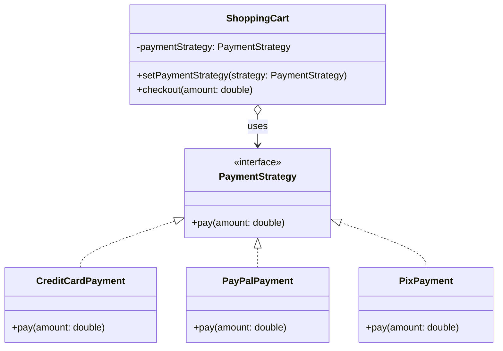
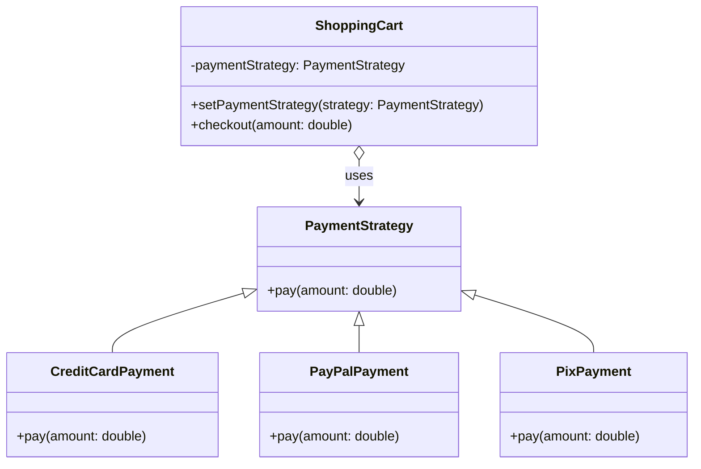

# Sistema de Pagamento com Padrão Strategy

## Resumo do Projeto

**Nome do Projeto:** Sistema de Pagamento Flexível utilizando o Padrão Strategy

## Visão Geral

Este projeto demonstra o uso do **Padrão de Projeto Strategy** para criar um sistema de pagamento flexível e de fácil manutenção. Ele modela um cenário básico de compras online onde os clientes podem escolher diferentes métodos de pagamento (ex.: Cartão de Crédito, PayPal, Pix) no checkout.

## Objetivo

Desacoplar a lógica de processamento de pagamento da aplicação principal, permitindo que novos métodos de pagamento sejam adicionados com mudanças mínimas no código existente.

## Principais Componentes

- `PaymentStrategy` (interface): Define um método comum `pay(double amount)` para todos os tipos de pagamento.
- Estratégias concretas:
  - `CreditCardPayment`
  - `PayPalPayment`
  - `PixPayment`
- `ShoppingCart`: Classe de contexto que usa a estratégia de pagamento selecionada para realizar o checkout.

## Benefícios do Design

- Segue o **Princípio Aberto/Fechado (OCP)**: facilmente extensível sem modificar a lógica principal.
- Promove **reutilização de código e separação de responsabilidades**.
- Suporte para **seleção em tempo de execução** dos algoritmos de pagamento.

## Estrutura de Pastas

```plaintext
src/main/java/
└── edu/fatec/ipp002/strategy/
    ├── paymentmethod/             # Interface de strategy e implementações
    ├── model/                     # Modelo principal: ShoppingCart
    └── PatternApplication.java    # Ponto de entrada com exemplo de uso
```

## Casos de Uso

- Ensino e prática do Padrão Strategy.
- Protótipos de sistemas que exigem comportamentos intercambiáveis (ex.: pagamentos, algoritmos de ordenação, opções de envio).

## Diagrama de Classes



## Exemplo de Anti-Padrão: Uso Indevido de Herança

Abaixo está um diagrama de classes que mostra um anti-padrão comum ao implementar Strategy: usar herança sem reaproveitamento.



> 🚫 Nesta versão, `PaymentStrategy` é uma superclasse em vez de uma interface, e nenhum código é realmente reaproveitado. As subclasses sobrescrevem `pay()` sem aproveitar a herança — tornando isso um anti-padrão.

## Próximos Passos (Opcional)

- Adicionar novas estratégias como Criptomoeda ou Boleto.
- Integrar estratégias de desconto ou cálculos de imposto utilizando o mesmo padrão.
- Aplicar testes unitários para cada estratégia.

## Executando

Estando na pasta raiz onde se encontra o `pom.xml` — seja para o projeto _padrão_ ou _anti-padrão_ —, execute os seguintes comandos:

```bash
mvn clean spring-boot:run
```
