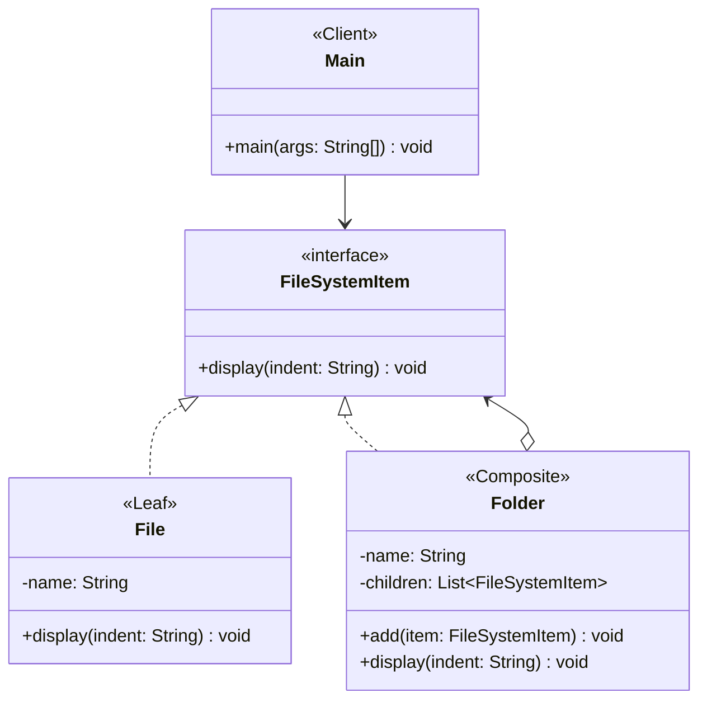
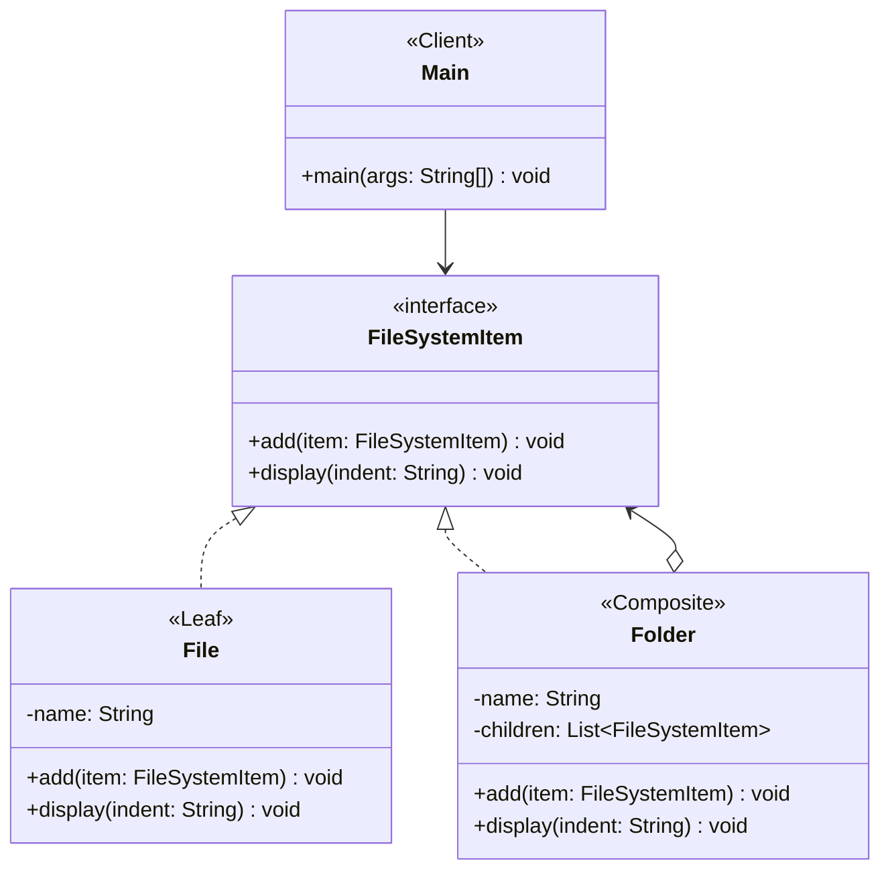

# Sistema de Arquivos com Padrão Composite

## Resumo do Projeto

**Nome do Projeto:** Sistema de Arquivos utilizando o Padrão Composite

## Visão Geral

Este projeto demonstra o **Padrão de Projeto Composite** através de um modelo simplificado de sistema de arquivos. Ele mostra como tratar arquivos individuais (`files`) (os **Leafs**) e pastas (`folders`) (os **Composites**) — que podem conter mais arquivos e pastas — usando uma interface comum, permitindo operações recursivas como exibir a estrutura.

## Objetivo

Demonstrar o Padrão Composite modelando um sistema de arquivos hierárquico onde tanto `File` quanto `Folder` podem ser tratados de forma uniforme através de uma interface compartilhada.

## Principais Componentes

| Componente            | Responsabilidade                                |
| --------------------- | ----------------------------------------------- |
| Interface `Component` | Declara a interface para todos os elementos     |
| Classe `Leaf`         | Representa objetos únicos (sem filhos)          |
| Classe `Composite`    | Contém filhos e implementa operações recursivas |
| `Client`              | Usa a interface para tratar todos os elementos  |

## Benefícios do Design

- Uniformidade: Tratar objetos e grupos da mesma forma.
- Estruturas recursivas de forma simples.
- Princípio Aberto/Fechado (OCP).
- Código do cliente simplificado.
- Melhora a reutilização e testabilidade do código.
- Modelagem de domínio clara.

## Estrutura de Pastas

```plaintext
src/main/java/
└── edu/fatec/ipp002/composite/
    ├── component/          # FileSystemItem
    ├── composite/          # Folder
    ├── leaf/               # File
    └── Main.java           # Ponto de entrada com exemplo de uso
```

## Casos de Uso

- **Modelagem de Sistema de Arquivos:** Simular ou gerenciar arquivos e pastas em uma estrutura hierárquica.
- **Hierarquias de Componentes de UI:** Interfaces gráficas tratam botões, painéis, rótulos, etc., como elementos que podem conter outros elementos.
- **Hierarquias Organizacionais:** Modelar a estrutura de uma empresa com gestores e funcionários.
- **Scene Graphs em Jogos ou Motores Gráficos:** Objetos em uma cena (modelos, luzes, câmeras) podem ser compostos e agrupados.
- **Sistemas de Menu:** Menus e submenus em aplicativos ou sites.
- **Estruturas de Documentos (HTML, XML, PDFs):** Textos compostos por parágrafos, tabelas, imagens, etc., onde os componentes podem ser aninhados.
- **Hierarquias de Permissão e Papel:** Em sistemas de segurança complexos, papéis ou permissões podem ser agrupados.

## Diagrama de Classes



## Exemplo de Anti-Padrão: Leafs Implementando Métodos de Composite Inúteis

Às vezes desenvolvedores forçam classes folha (como `File`) a implementar métodos como `add()` ou `remove()` que só fazem sentido para composites (`Folder`).

> `File` possui um método `add(FileSystemItem)` vazio ou inútil apenas para se encaixar na interface.

`Por que isso é ruim`:

- Quebra o Princípio da Substituição de Liskov (LSP)
- Leva a APIs enganosas ou confusas
- Deixa o código frágil e difícil de manter

`Melhor Prática`: Use o modelo composite transparente apenas quando todos os métodos fizerem sentido para todos os tipos, ou então separe as interfaces quando não fizerem.



## Executando

Estando na pasta raiz onde se encontra o `pom.xml` — seja para o projeto _padrão_ ou _anti-padrão_ —, execute os seguintes comandos:

```bash
mvn clean install
mvn exec:java
```
