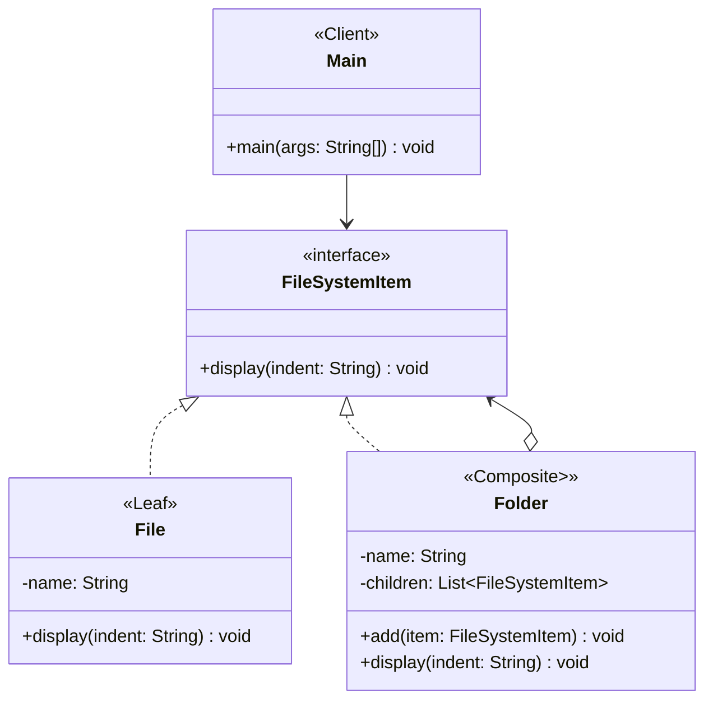

# File System Composite Pattern

## Project Summary

**Project Name:** File System using the Composite Pattern

### Overview

This project demonstrates the **Composite Design Pattern** through a simplified file system model. It shows how to treat individual `files` (the **Leaf**) and `folders` (the **Composite**) (which may contain more files and folders) using a common interface, enabling recursive operations such as displaying structure.

### Goal

To demonstrate the Composite Design Pattern by modeling a hierarchical file system where both `File` and `Folder` can be treated uniformly through a shared interface.

### Key Components

| Component                  | Responsibility                                            |
| -------------------------- | --------------------------------------------------------- |
| `Component` interface        | Declares interface for all elements |
| `Leaf` class       | Represents single objects (no children)   |
| `Composite` class     | Holds children and implements recursive ops             |
| `Client` | Uses the interface to treat all elements                              |

### Design Benefits

* Uniformity: Treat Objects and Groups the Same Way.
* Recursive Structures Made Easy.
* Open/Closed Principle (OCP).
* Simplified Client Code.
* Improves Code Reusability and Testability.
* Clear Domain Modeling.

### Folder Structure

```
src/main/java/
└── edu/fatec/ipp002/composite/
    ├── component/          # FileSystemItem
    ├── composite/          # Folder
    ├── leaf/               # File
    └── Main.java           # Entry point with usage example
```

### Use Cases

* **Modeling a File System:** Simulating or managing files and folders in a hierarchical structure.
* **UI Component Hierarchies:** Graphical UIs often treat buttons, panels, labels, etc., as elements that can contain other elements.
* **Organizational Hierarchies:** Modeling a company’s structure with managers and employees.
* **Scene Graphs in Games or Graphics Engines:** Objects in a scene (e.g., models, lights, cameras) can be composed and grouped.
* **Menu Systems:** Menus and submenus in applications or websites.
* **Document Structures (e.g., HTML, XML, PDFs):** Texts made of paragraphs, tables, images, etc., where components can be nested.
* **Permission and Role Hierarchies:** In complex security systems, roles or permissions can be grouped.

### Class Diagram


### Anti-Pattern Example: Leafs Implementing Useless Composite Methods

Sometimes developers force leaf classes (like `File`) to implement methods like `add()` or `remove()` which only make sense for composites (`Folder`).

> `File` has a stubbed or empty `add(FileSystemItem)` method just to fit the interface.

`Why it's bad`:
* Breaks the Liskov Substitution Principle
* Leads to misleading or confusing APIs
* Makes the code fragile and harder to maintain

`Best Practice`: Use the transparent composite model only when all methods are meaningful to all types, or separate interfaces if not.
 
 ```mermaid
 classDiagram
    class FileSystemItem {
        <<interface>>
        +add(item: FileSystemItem) void
        +display(indent: String) void
    }

    class File {
        <<Leaf>>
        -name: String
        +add(item: FileSystemItem) void
        +display(indent: String) void
    }

    class Folder {
        <<Composite>>>
        -name: String
        -children: List~FileSystemItem~
        +add(item: FileSystemItem) void
        +display(indent: String) void
    }

    class Main {
        <<Client>>
        +main(args: String[]) void
    }

    Main --> FileSystemItem
    FileSystemItem <|.. File
    FileSystemItem <|.. Folder
    FileSystemItem <--o Folder
 ```

## Running
Place yourself in the root folder where the `pom.xml` is located — whether for a *pattern* or *anti-pattern* project. Then, run the following commands:

```Bash
mvn clean install
mvn exec:java
```