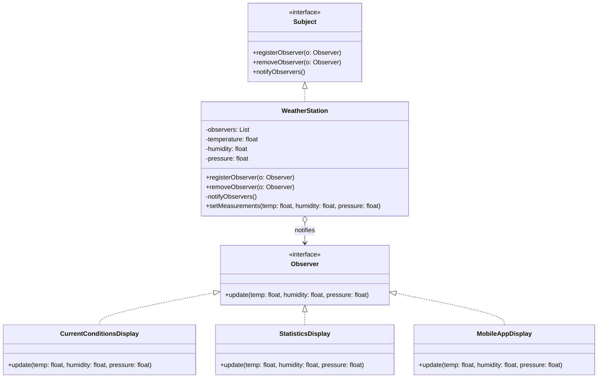
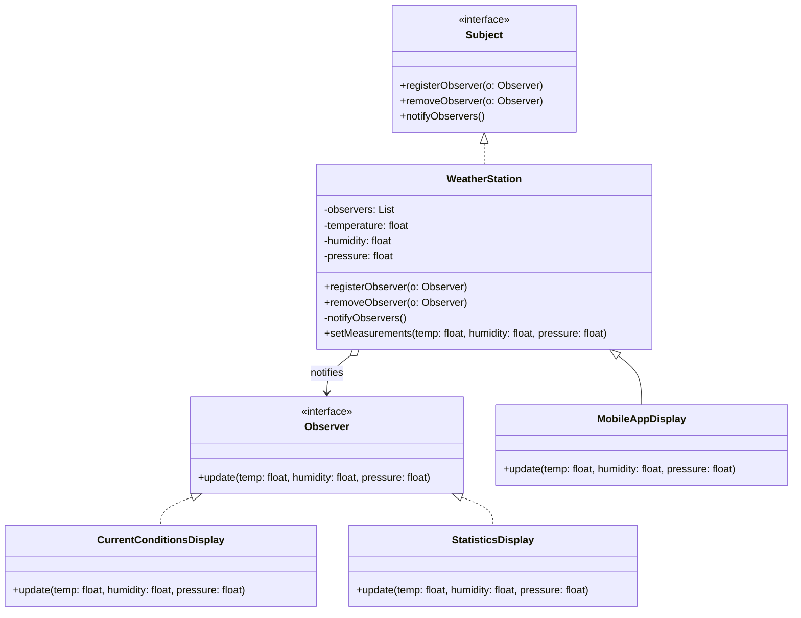

# Weather Station Observer Pattern

## Project Summary

**Project Name:** Weather Station using the Observer Pattern

## Overview

This project demonstrates the **Observer Design Pattern** in a simple and practical way by modeling a weather monitoring system. A central `WeatherStation` (the **Subject**) gathers and distributes weather data to multiple **Observers** such as display units and mobile applications. Each observer updates itself automatically when the weather changes.

## Goal

To **decouple the core data source** (`WeatherStation`) from its dependent components (`Displays`) so they can evolve independently and be reused or replaced without affecting each other.

## Key Components

| Component                  | Responsibility                                            |
| -------------------------- | --------------------------------------------------------- |
| `Subject` interface        | Allows observers to register, unregister, and be notified |
| `Observer` interface       | Declares the `update()` method observers must implement   |
| `WeatherStation` class     | Holds weather data and notifies all observers             |
| `CurrentConditionsDisplay` | Displays current temperature                              |
| `StatisticsDisplay`        | Tracks min, max, and average temperature                  |
| `MobileAppDisplay`         | Simulates a mobile app notification system                |

## Design Benefits

* Implements the **Observer Pattern** to decouple state from behavior.
* Follows **Open/Closed Principle**: easily add new displays without modifying core logic.
* Promotes flexibility and **runtime configurability** of observers.

## Folder Structure

```
src/main/java/
└── edu/fatec/ipp002/observer/
    ├── observer/            # Observer and Subject interfaces
    ├── model/               # WeatherStation (the subject)
    ├── display/             # Concrete observer classes
    └── Main.java            # Entry point with usage example
```

## Use Cases

* Teaching and practicing the Observer Pattern.
* Prototyping modular notification systems.
* Scenarios where multiple components depend on shared state changes

## Class Diagram



## Anti-Pattern Example: Tight Coupling Between Observer and Subject

If the subject makes assumptions about specific observer implementations, you lose the decoupling the pattern is supposed to provide.

`Why it’s bad`: Breaks the flexibility of the pattern and leads to fragile code.

`Best Practice`: Communicate only through interfaces, never through concrete types.



## Running
Place yourself in the root folder where the `pom.xml` is located — whether for a *pattern* or *anti-pattern* project. Then, run the following commands:

```Bash
mvn clean install
mvn exec:java
```