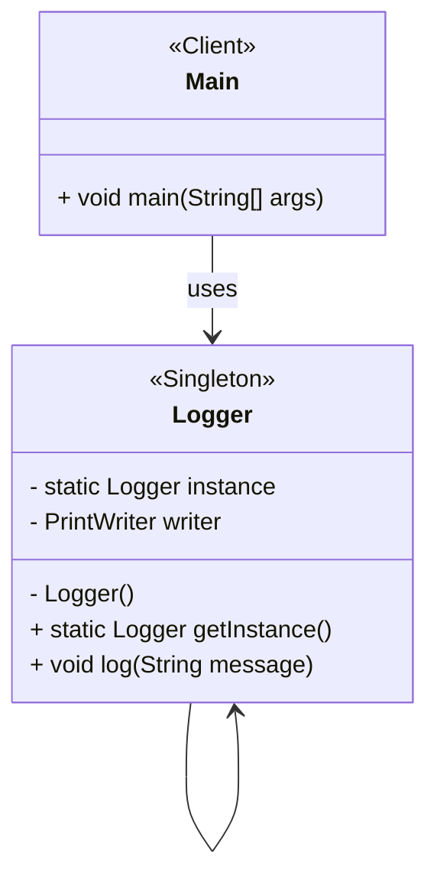

# Logger Singleton Pattern

## Project Summary

**Project Name:** Logger using the Singleton Pattern

## Overview

This project demonstrates the use of the **Singleton Design Pattern** by implementing a simple Logger class. The logger is responsible for writing messages to a log file and ensures that only one instance is ever created and shared across the entire application.

## Goal

To demonstrate how the Singleton pattern helps centralize access to a shared resource (in this case, a log file). Illustrating a real-world use case for a Singleton: logging, which must be consistent and globally accessible.

## Key Components

| Component                  | Responsibility                                            |
| -------------------------- | --------------------------------------------------------- |
| `Logger` Singleton class        | Guarantees a single instance, offers global access via getInstance(), and manages logging to a file. |
| `Main` class       | Demonstrates usage of the Singleton.   |
| `log.txt` Log file     | Stores log messages consistently, no matter how many parts of the app are logging.             |

## Design Benefits

* Controlled Access to Single Instance.
* Global Point of Access.
* Resource Efficiency.
* Lazy Initialization.
* Consistency Across the Application.
* Ease of Maintenance and Testing.

## Folder Structure

```
src/main/java/
└── edu/fatec/ipp002/singleton/
    ├── logger/         # Singleton
    ├── Main.java       # Usage
    └── log.txt         # Log file
```

## Use Cases

* **Configuration Manager:** To read app-wide settings (from a .properties, .env, or XML/JSON file) in one place.
* **Database Connection Pool Manager:** To Manage DB connections centrally improves performance and avoids opening too many connections.
* **Cache Manager:** A shared, in-memory cache that all parts of the app can read/write to.
* **Thread Pool Manager:** Thread pools should be reused, not re-created every time a task is run.
* **Authentication / Session Manager:** A single class tracking who is logged in or managing tokens avoids conflicts and ensures security.
* **Device Drivers or Hardware Access Layer:** You usually want one controller to manage communication with specific hardware (e.g., printer, GPU).
* **Game Settings or State Manager:** In game development, things like scoreboards, level data, or game settings should be globally accessible but consistently managed.

## Class Diagram



## Running
Place yourself in the root folder where the `pom.xml` is located. Then, run the following commands:

```Bash
mvn clean install
mvn exec:java
```