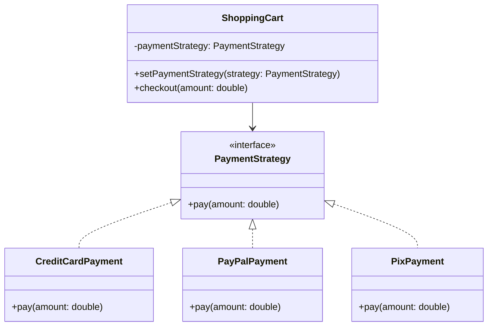
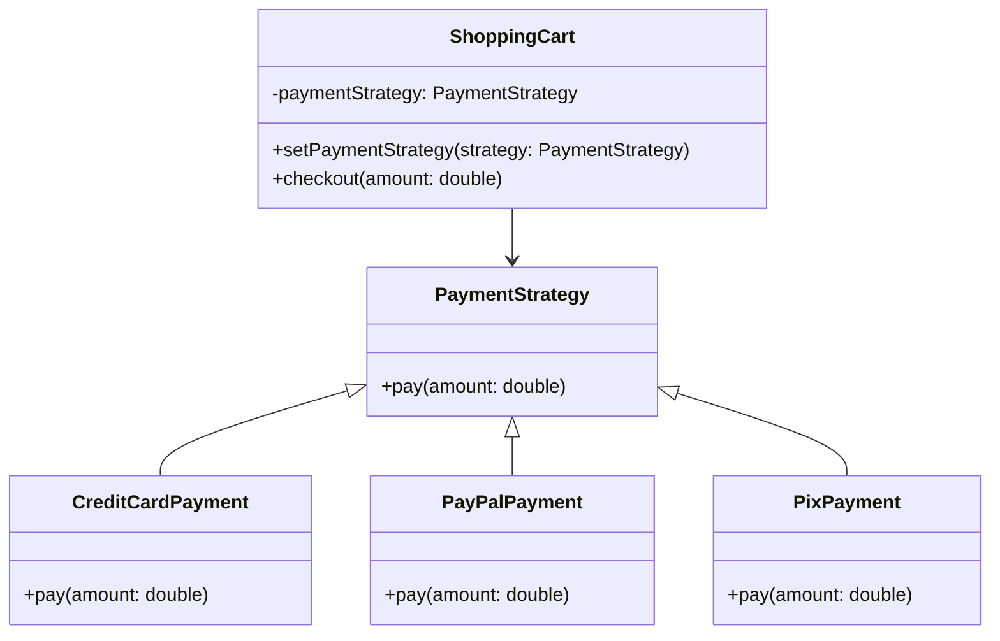

# Payment Strategy Pattern

## Project Summary

**Project Name:** Flexible Payment System using the Strategy Pattern

### Overview

This project demonstrates the use of the **Strategy Design Pattern** to create a flexible and maintainable payment system. It models a basic online shopping scenario where customers can select different payment methods (e.g., Credit Card, PayPal, Pix) at checkout.

### Goal

To decouple the payment processing logic from the main application, allowing new payment methods to be added with minimal changes to the existing codebase.

### Key Components

* `PaymentStrategy` (interface): Defines a common method `pay(double amount)` for all payment types.
* Concrete strategies:

  * `CreditCardPayment`
  * `PayPalPayment`
  * `PixPayment`
* `ShoppingCart`: The context class that uses a selected payment strategy to perform checkout.

### Design Benefits

* Follows the **Open/Closed Principle**: easily extendable without modifying core logic.
* Promotes **code reuse and separation of concerns**.
* Supports **runtime selection** of payment algorithms.

### Folder Structure

```
src/main/java/
└── edu/fatec/ipp002/strategy/
    ├── paymentmethod/             # Payment strategy interface and implementations
    ├── model/                     # Core model: ShoppingCart
    └── PatternApplication.java    # Entry point with usage example
```

### Use Cases

* Teaching and practicing the Strategy Design Pattern.
* Prototype for systems that require interchangeable behaviors (e.g., payments, sorting algorithms, shipping options).

### Class Diagram



### Anti-Pattern Example: Misusing Inheritance

Below is a class diagram showing a common anti-pattern when implementing Strategy: using inheritance without reuse.



> 🚫 In this version, `PaymentStrategy` is a superclass instead of an interface, and no code is actually reused. Subclasses override `pay()` without leveraging inheritance — making this an anti-pattern.

### Next Steps (Optional)

* Add new strategies like Cryptocurrency or Boleto.
* Integrate discount strategies or tax calculations using the same pattern.
* Apply unit tests for each strategy.